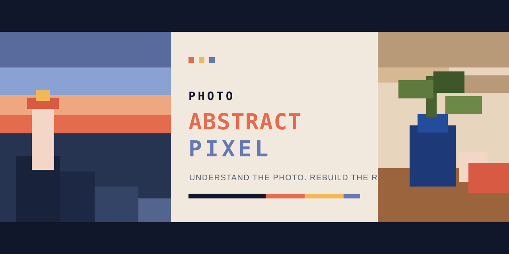
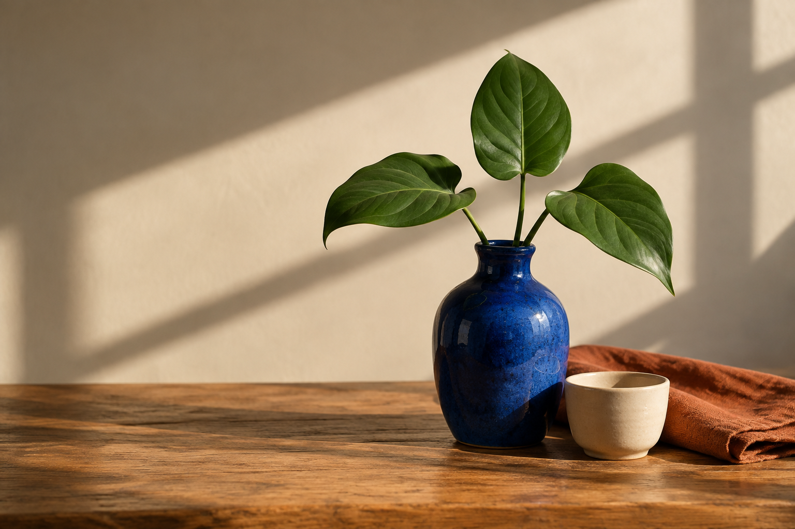
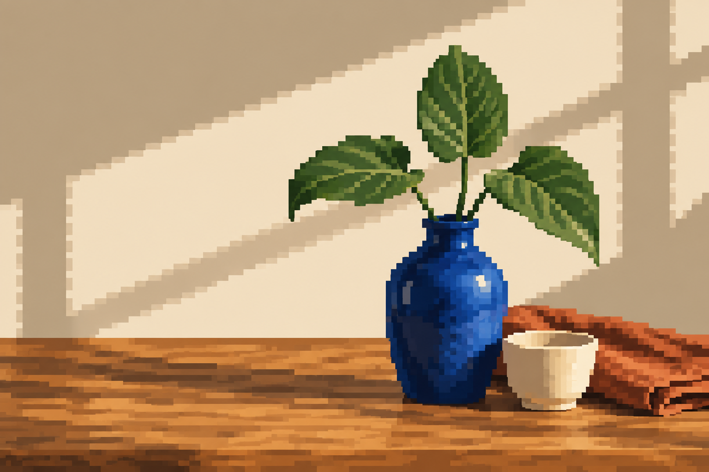

<div align="center">



# Photo Abstract Pixel

**Understand the photograph. Rebuild it in pixels.**

[](./SKILL.md)
[](./LICENSE)
[](./README.md)
[](./README.en.md)

A Codex Skill that semantically redraws photographs as restrained abstract pixel art. It preserves subject, composition, and color relationships while deliberately discarding photorealistic detail.

</div>

---

## ✦ Gallery

Every example was created specifically for this repository from fictional, person-free source material. No private images from prior conversations are included.

<table>
  <tr><th width="50%">Source</th><th width="50%">Abstract pixel redraw</th></tr>
  <tr>
    <td></td>
    <td></td>
  </tr>
  <tr>
    <td></td>
    <td></td>
  </tr>
  <tr>
    <td></td>
    <td></td>
  </tr>
</table>

> Gallery assets demonstrate the output direction only. They are not loaded as runtime style references.

## ✦ What it is

| It does | It does not |
| :--- | :--- |
| Reconstruct subjects, space, direction, and visual weight | Downscale and enlarge a photograph |
| Derive a limited palette from the source | Apply a uniform mosaic filter |
| Build coherent, intentional pixel clusters | Add random dithering or glitch noise |
| Preserve the core event and composition | Turn people into chibi game sprites by default |
| Deliver one complete standalone artwork | Add titles, borders, HUDs, or poster panels by default |

In short: **designed redraw, not filtered pixelation.**

## ✦ Quick start

Clone the repository directly into your Codex skills directory:

```bash
git clone https://github.com/modest021/photo-abstract-pixel.git ~/.codex/skills/photo-abstract-pixel
```

Windows PowerShell:

```powershell
git clone https://github.com/modest021/photo-abstract-pixel.git "$env:USERPROFILE\.codex\skills\photo-abstract-pixel"
```

Start a new Codex conversation, upload an image, and ask:

> Use `$photo-abstract-pixel` to redraw this image as restrained abstract pixel art.

You can also copy the standalone [Chinese prompt](./references/photo-abstract-pixel-prompt.zh-CN.md) or [English prompt](./references/photo-abstract-pixel-prompt.en.md).

## ✦ How it works

```text
Read relationships → isolate decisive structure → compress palette → rebuild in clusters → one finished image
```

1. Identify subjects, depth, negative space, direction, and light/color relationships.
2. Choose a logical low-resolution grid that fits the scene instead of mechanically tiling it.
3. Place large silhouettes and areas first, then retain only essential identity cues.
4. Extract roughly 6–14 colors from the source and merge nearby values.
5. Keep the original aspect ratio by default and return a clean standalone artwork.

## ✦ Tunable controls

| Control | Range | Guidance |
| :--- | :--- | :--- |
| Abstraction | recognizable ↔ geometric | medium by default |
| Pixel grid | fine ↔ coarse | finer for groups, coarser for simple still life |
| Palette | 6–14 colors | fewer colors feel more restrained |
| Identity cues | silhouette, pose, accessory, landmark feature | keep only what is necessary |
| Crop | original ratio ↔ slight crop | never alter the core event |

## ✦ Principles

- **The source image is the only content source.** No invented subjects, props, text, or story beats.
- **Relationships matter more than details.** Preserve scale, placement, direction, layers, and negative space.
- **Every cluster should have intent.** Pixels describe contour, light, or spatial rhythm.
- **Restrained, not automatically retro.** No default HUD, neon cyberpunk treatment, or cute sprite proportions.

## ✦ Privacy and image rights

- Uploaded images may be sent to the image-generation service you use; consult that service's privacy policy.
- Make sure you have the right to process your inputs, especially portraits, commercial photography, and copyrighted frames.
- This repository's license does not grant rights to user inputs or third-party content in generated outputs.
- See [assets/examples/SOURCES.md](./assets/examples/SOURCES.md) for gallery provenance.

## ✦ License

Released under the [MIT License](./LICENSE).

<div align="center">

If this skill turns a photograph into a memorable pixel abstraction, consider leaving a Star ✦

</div>
