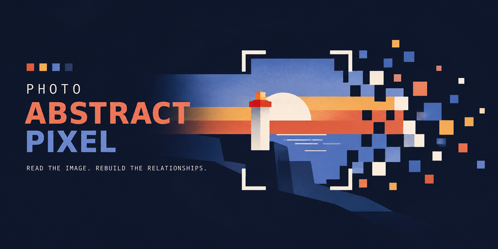
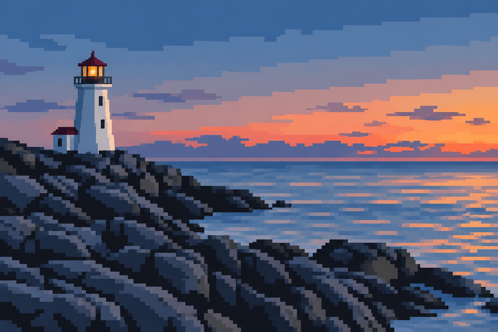
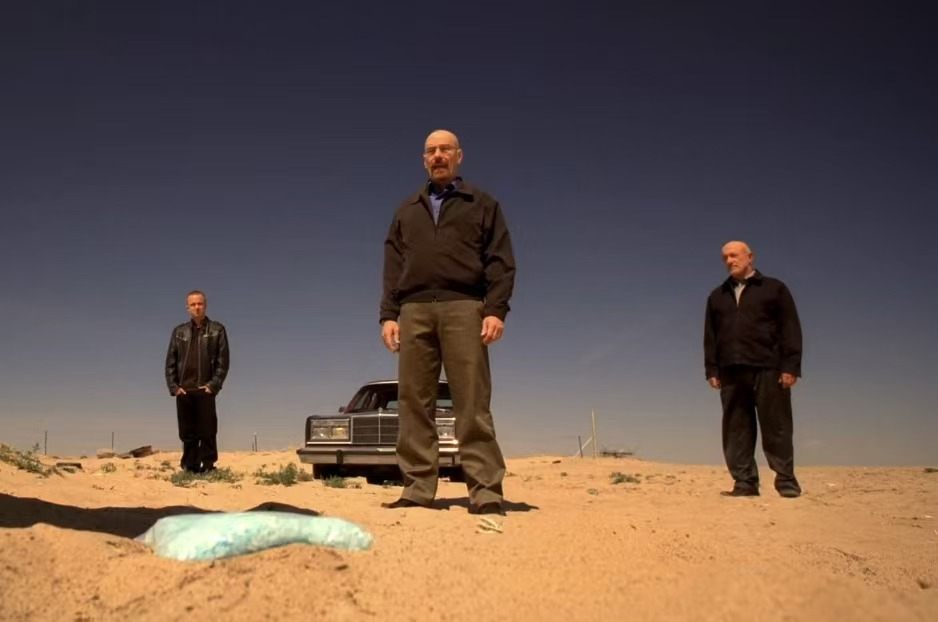
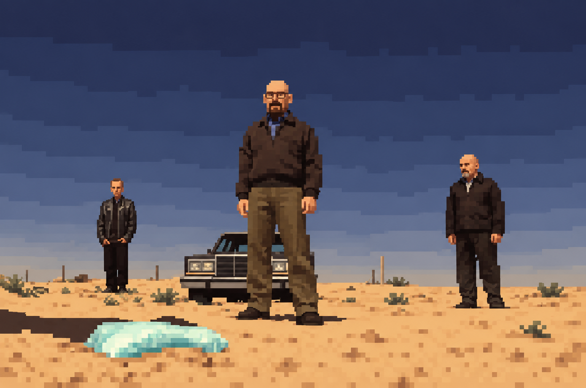
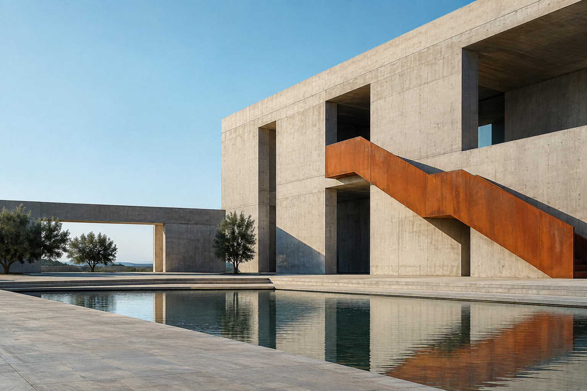
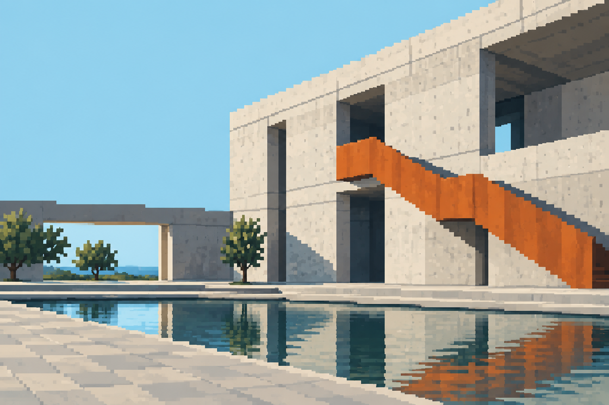
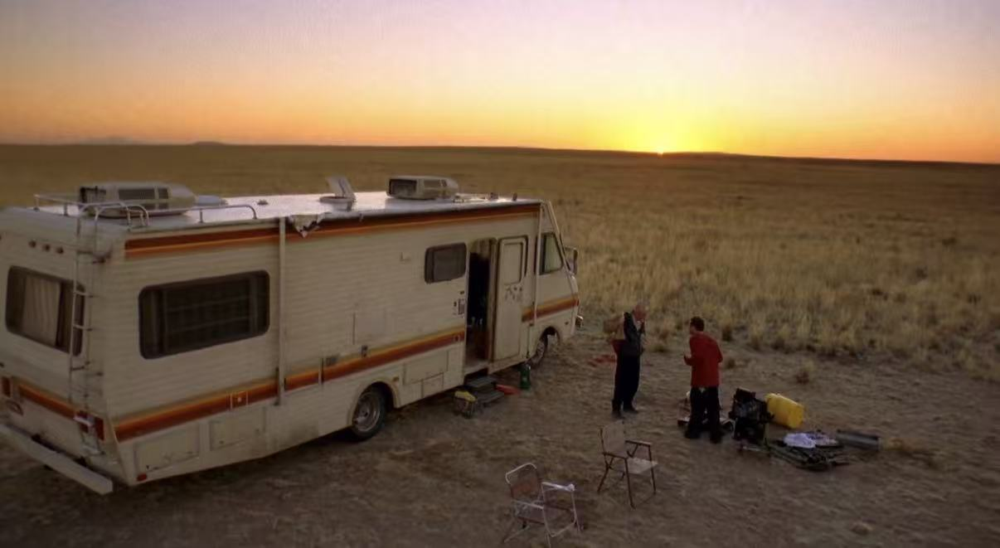
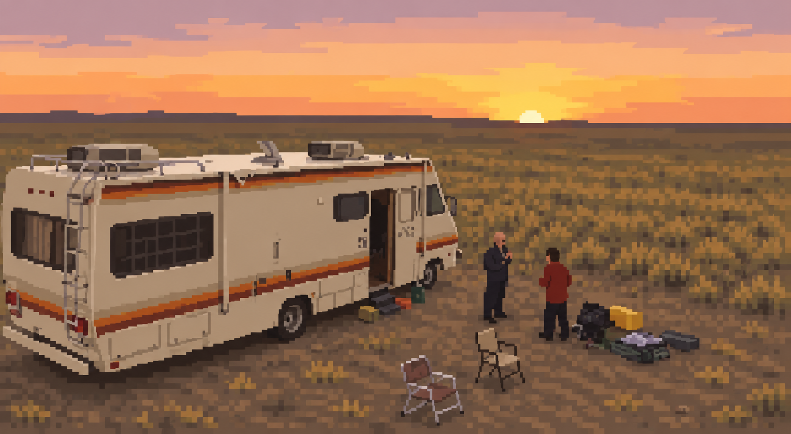

<div align="center">



# Photo Abstract Pixel

**理解照片，再用像素重新组织它。**

[](./SKILL.md)
[](./LICENSE)
[](./README.md)
[](./README.en.md)

一个把照片**语义级重绘**为克制抽象像素艺术的 Codex Skill。它保留主体、构图和色彩关系，却主动舍弃写实细节。

</div>

---

## ✦ 效果预览

画廊保留两组原创、无人物演示素材，并加入两组由用户提供画面生成的抽象像素重绘。

<table>
  <tr>
    <th width="50%">原始图像</th>
    <th width="50%">抽象像素重绘</th>
  </tr>
  <tr>
    <td></td>
    <td></td>
  </tr>
  <tr>
    <td></td>
    <td></td>
  </tr>
  <tr>
    <td></td>
    <td></td>
  </tr>
  <tr>
    <td></td>
    <td></td>
  </tr>
</table>

> 第一、三组为本仓库原创演示素材；第二、四组为绝命毒师影视截图。详见 [素材来源说明](./assets/examples/SOURCES.md)。

## ✦ 它是什么

| ✅ 会做 | ❌ 不会做 |
| :--- | :--- |
| 理解主体、空间、方向和视觉重心 | 把原图直接缩小再放大 |
| 用有限色板重建明暗与色彩角色 | 套统一马赛克滤镜 |
| 用连贯像素簇归纳复杂形体 | 随机抖动、glitch 或噪点堆积 |
| 保持照片的核心事件和构图关系 | 自动变成 Q 版人物或游戏精灵 |
| 输出一张独立、完整的艺术作品 | 默认添加文字、边框、HUD 或海报面板 |

核心区别只有一句话：**这是设计后的重绘，不是滤镜式像素化。**

## ✦ 快速开始

### 安装

将仓库直接克隆到 Codex skills 目录：

```bash
git clone https://github.com/modest021/photo-abstract-pixel.git ~/.codex/skills/photo-abstract-pixel
```

Windows PowerShell：

```powershell
git clone https://github.com/modest021/photo-abstract-pixel.git "$env:USERPROFILE\.codex\skills\photo-abstract-pixel"
```

重新开启 Codex 对话后，上传一张图片并调用：

> 使用 `$photo-abstract-pixel` 将这张图片重新绘制为抽象像素风。

### 直接使用提示词

不安装 Skill 也可以复制完整提示词：

| 语言 | 文件 |
| :---: | :--- |
| 🇨🇳 中文 | [photo-abstract-pixel-prompt.zh-CN.md](./references/photo-abstract-pixel-prompt.zh-CN.md) |
| 🇬🇧 English | [photo-abstract-pixel-prompt.en.md](./references/photo-abstract-pixel-prompt.en.md) |

## ✦ 工作方式

```text
观察照片关系  →  提炼决定性结构  →  压缩色板  →  像素簇重构  →  单张成品
```

1. 识别主体、前中后景、负空间、运动方向和光色关系。
2. 根据场景复杂度选择低分辨率逻辑网格，而不是机械均分画面。
3. 先安排大轮廓和面积，再用少量小像素簇保留必要身份线索。
4. 从原图提炼 6–14 种颜色，合并相近色与明度层级。
5. 默认保持原图比例，输出无标题、无边框、无界面的完整作品。

## ✦ 可以怎么调

| 参数 | 调整方向 | 建议 |
| :--- | :--- | :--- |
| 抽象度 | 更可辨认 ↔ 更几何 | 默认中等，先保留主体关系 |
| 像素网格 | 更细 ↔ 更粗 | 复杂群像用稍细网格，简单静物可更粗 |
| 色板规模 | 6–14 色 | 少色更克制，多色更接近原图光感 |
| 身份线索 | 轮廓、姿态、配饰、建筑特征 | 每个主体只保留最低必要信息 |
| 构图裁切 | 原比例 ↔ 轻微裁切 | 不改变核心事件与主体关系 |

你也可以直接说：

- “再抽象一点，只保留建筑轮廓和天空色带。”
- “人物仍要能分辨，但减少面部细节。”
- “用更粗的像素簇和 8 色以内的色板。”
- “保持原构图，不要添加任何文字或装饰。”

## ✦ 设计原则

- **照片是唯一内容来源。** 不发明新人物、物件、文字或叙事。
- **关系比细节重要。** 优先保留比例、位置、方向、层次和负空间。
- **像素簇必须有意图。** 每组像素都服务于轮廓、光影或空间节奏。
- **克制而非怀旧。** 默认现代、平面、艺术化，不自动套用复古游戏语言。

## ✦ 仓库结构

```text
photo-abstract-pixel/
├── SKILL.md                     # Skill 的运行规则
├── agents/openai.yaml           # Codex 界面元数据
├── references/                  # 可直接复制的中英文提示词
├── assets/
│   ├── brand/                   # 图标、主视觉和社交预览
│   └── examples/                # 原创 Before / After 示例
├── README.md
├── README.en.md
└── LICENSE
```

## ✦ 图片与隐私

- 上传图片可能会被发送到你所使用的图像生成服务；请遵循该服务的隐私政策。
- 请确保你有权处理输入图片，尤其是人物照片、商业摄影和受版权保护的画面。
- 本仓库许可证只覆盖仓库本身，不自动授予任何用户输入图片或生成结果的第三方权利。
- 示例素材说明见 [assets/examples/SOURCES.md](./assets/examples/SOURCES.md)。

## ✦ License

本项目的 Skill、文档及原创品牌素材采用 [MIT License](./LICENSE)。用户提供的第三方示例画面及其衍生重绘不包含在该许可中。

<div align="center">

如果它帮你把一张照片变成了更有意思的像素记忆，欢迎点一个 Star ✦

</div>
